# Instructions on ThirdReality Smart Plug Private Cluster in Home Assistant ZHA

## ZHA Configuration

1）Create a Folder for Local Code Files:
a. Navigate to the /config directory.
b. Create a new folder with a name(e.g., thirdreality_quirks). This folder will store the local code files.

2）Place the plug.py File:
a. Use the Samba share tool to transfer the plug.py file into the newly created folder.

3）Edit the configuration.yaml File(as shown in the boxed area):

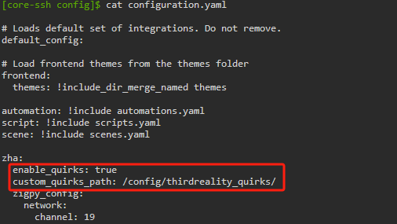

4）Restart Home Assistant:
a. Restart Home Assistant to apply the configuration changes.

## Operating Devices

**Note: These instructions describe the operation for a PLUG device. Similar methods can be applied to customize other ThirdReaity devices with private clusters.**

1) Add a PLUG Device

2) Access PLUG Device Settings, navigate to the details page of the added PLUG device, click the "Options" button, as shown in the screenshot

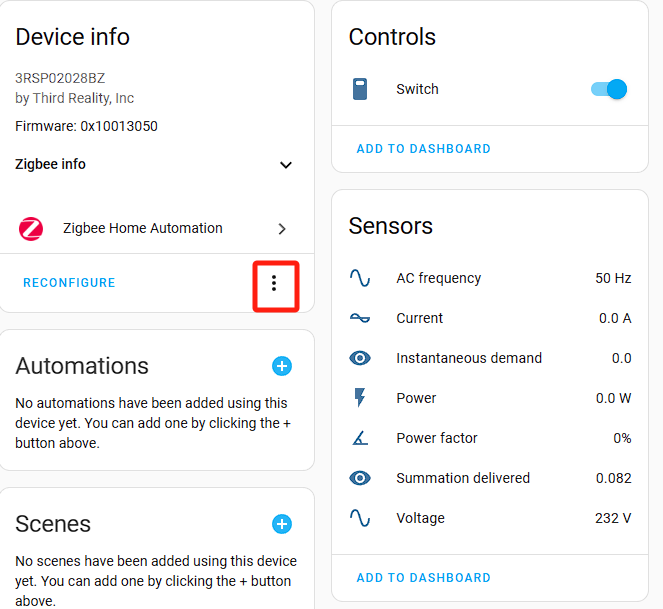

3) In the pop-up menu, choose the "Manage Zigbee Device" option.

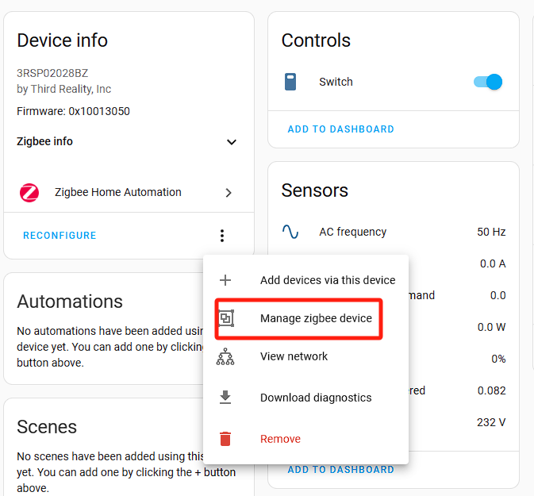

4) In the new window, select "ThirdRealityPlugCluster" from the "Clusters" drop-down list.

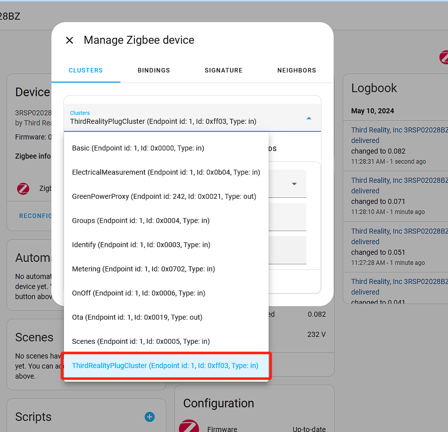

5) Under "ATTRIBUTES," locate "reset_summation_delivered.", set the "value" to 1, click the "WRITE ATTRIBUTE" button.

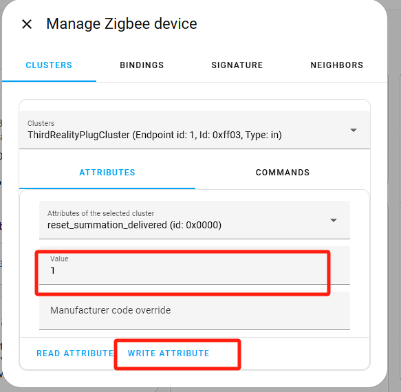

6)Compare the "Summation Delivered" display before and after sending the reset command. The following two screenshots show the difference.

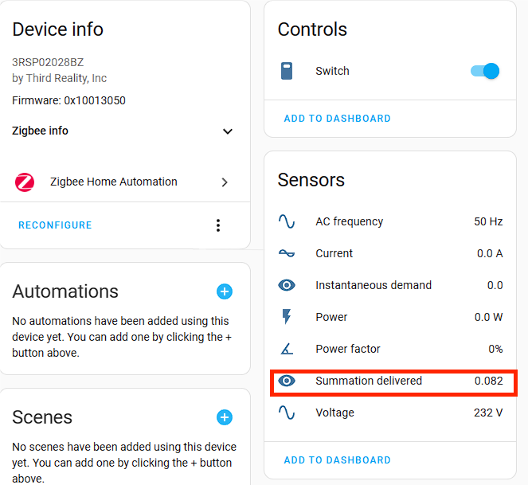

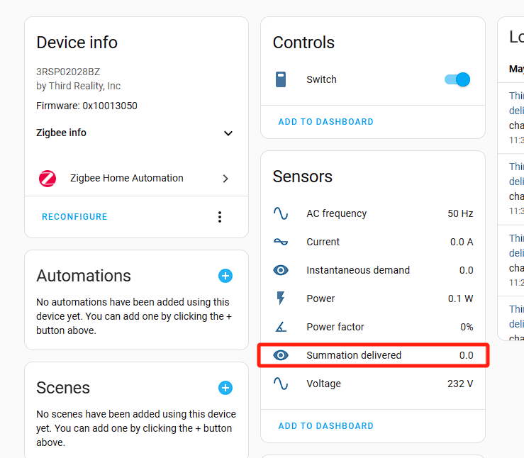

## 3.Access Smart Plug scripts on GitHub

URL：https://github.com/thirdreality

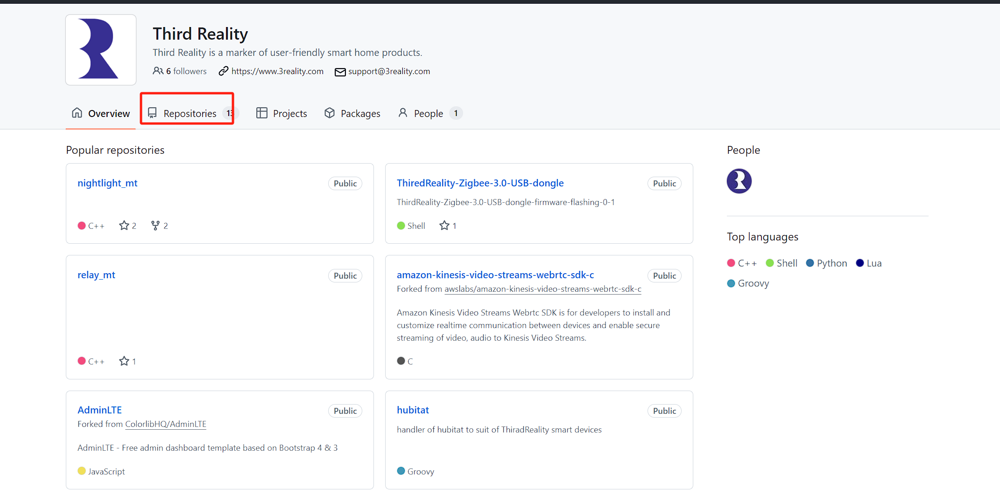

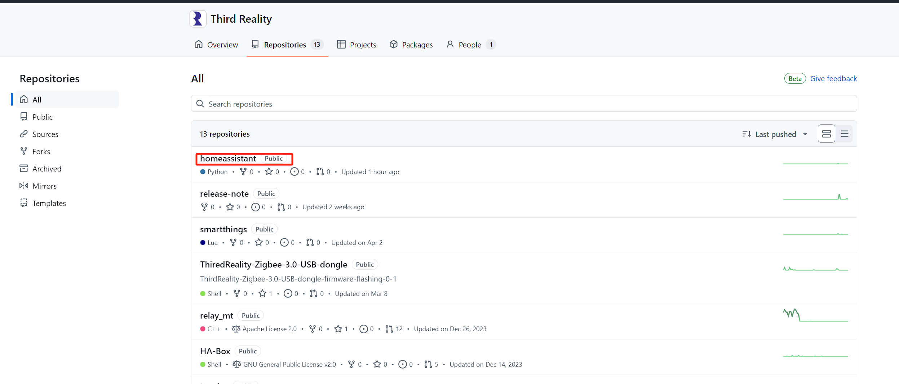

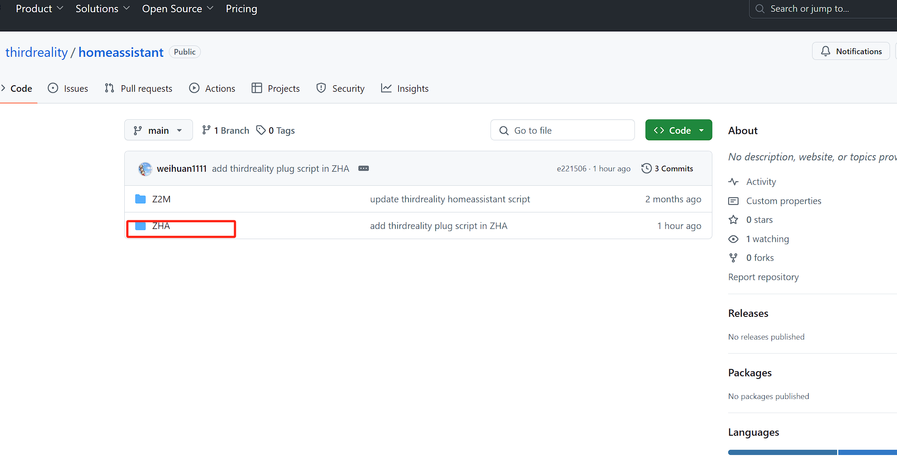

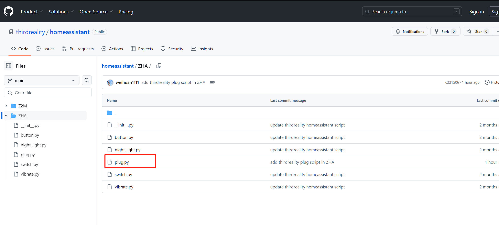
