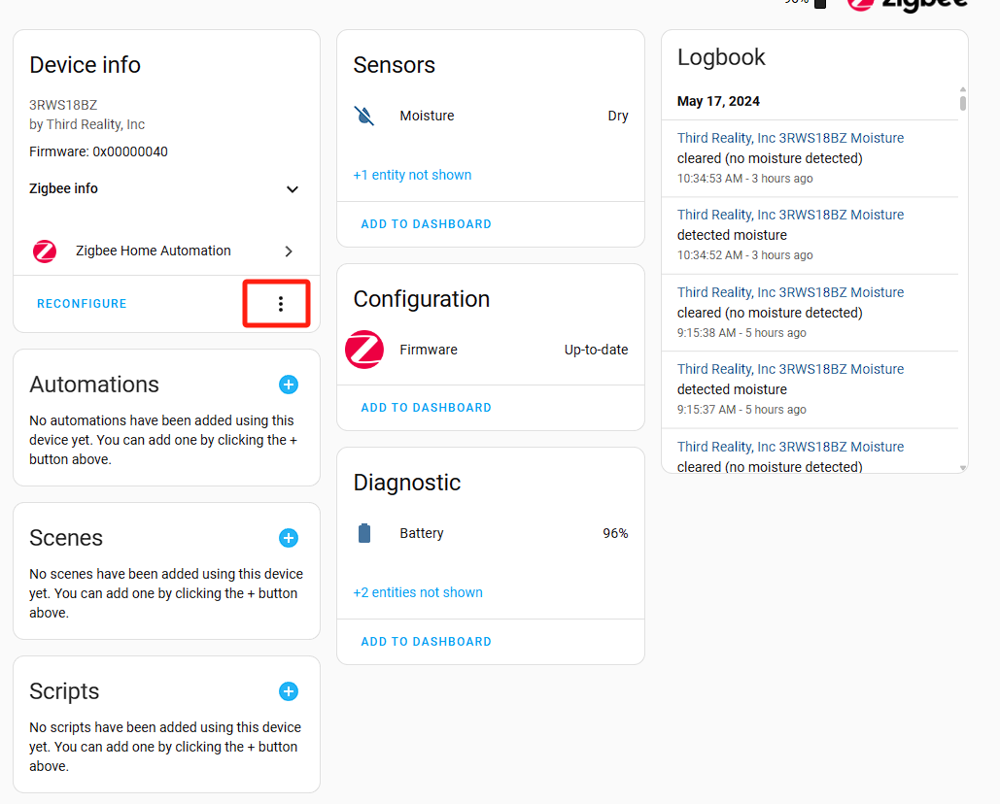
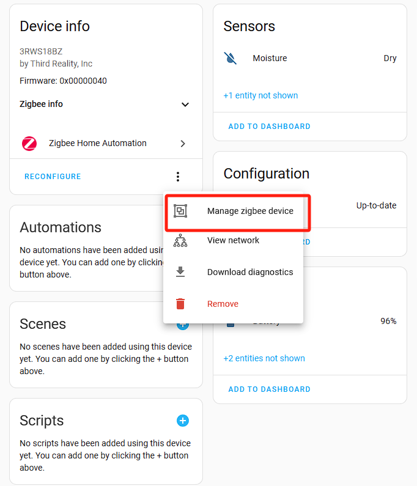
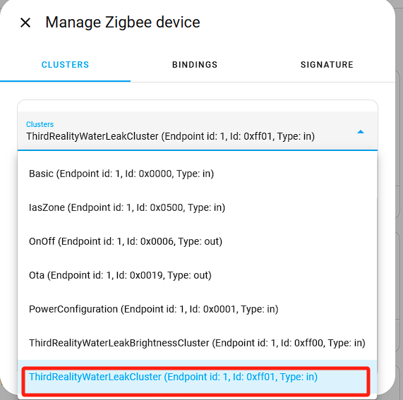
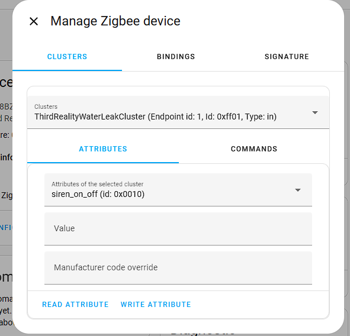
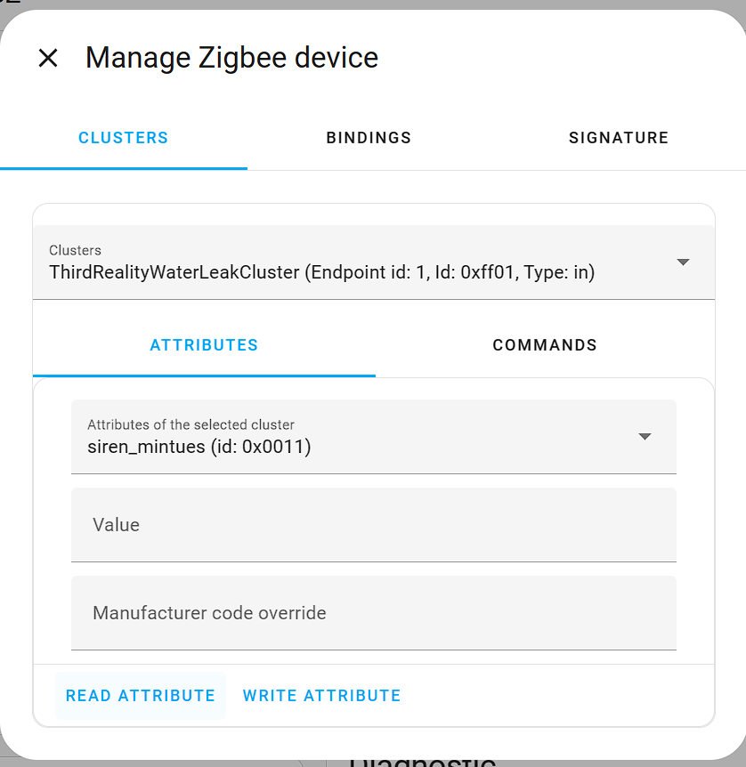
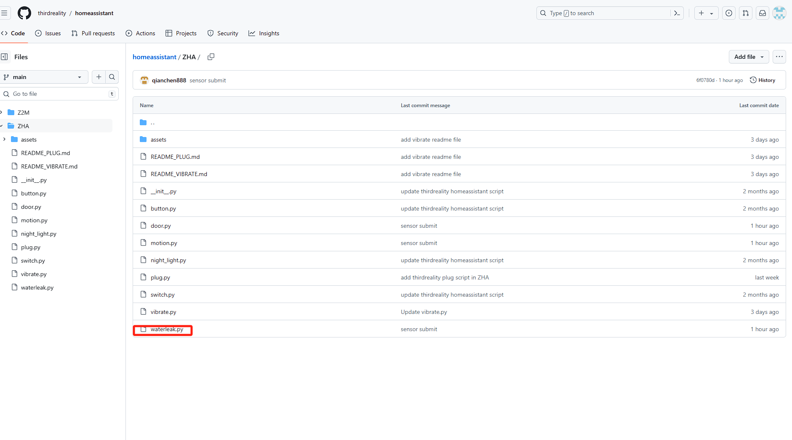

# Instructions on ThirdReality Water Leak Sensor Private Cluster in Home Assistant ZHA

## ZHA Configuration

1）Create a Folder for Local Code Files:
a. Navigate to the /config directory.
b. Create a new folder with a name(e.g., thirdreality_quirks). This folder will store the local code files.

2）Place the waterleak.py File:
a. Use the Samba share tool to transfer the waterleak.py file into the newly created folder.

3）Edit the configuration.yaml File(as shown in the boxed area):

4）Restart Home Assistant:
a. Restart Home Assistant to apply the configuration changes.

## Operating Devices

**Note: These instructions describe the operation for a WATER LEAK SENSOR device. Similar methods can be applied to customize other ThirdReaity devices with private clusters.**

1) Add a WATER LEAK SENSOR Device

2) Access WATER LEAK SENSOR Device Settings, navigate to the details page of the added WATER LEAK SENSOR device, click the "Options" button, as shown in the screenshot

3) In the pop-up menu, choose the "Manage Zigbee Device" option.

4) In the new window, select "ThirdRealityWaterLeakCluster" from the "Clusters" drop-down list.

5)Under "ATTRIBUTES," locate "siren_on_off", set the "value" to (0 or 1),value 0 is mute，1 is ringing, click the "WRITE ATTRIBUTE" button.

6) Under "ATTRIBUTES," locate "siren_mintues.", set the "value" to (0 -255),value 0 is Always ringing，1 is ringing one minutes, click the "WRITE ATTRIBUTE" button.

## 3.Access Smart Water Leak scripts on GitHub

URL：https://github.com/thirdreality

